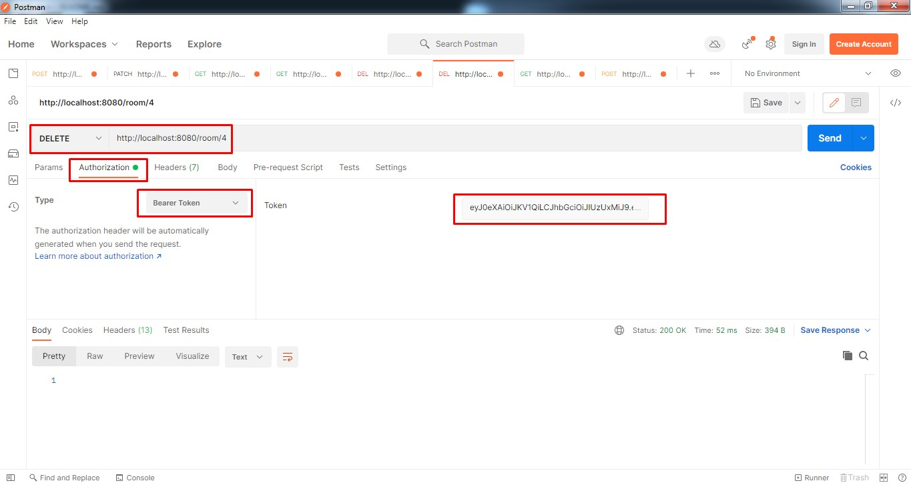

[](https://app.travis-ci.com/Azamat-Sult/job4j_chat)
# job4j_chat

В данном проекте реализован REST API для чата:

POST http://localhost:8080/person/sign-up - регистрируем нового пользователя.

{
"username": "Genius",
"password": "123456"
}

POST http://localhost:8080/login - входим в систему и получаем токен.

{
"username": "Genius",
"password": "123456"
}

GET http://localhost:8080/room/ - получаем список всех комнат чата вместе с сообщениями.

GET http://localhost:8080/room/{id} - получаем комнату по id вместе с сообщениями.

POST http://localhost:8080/room/ - создаем комнату.

{
"name": "Новая комната",
"description": "Описание новой комнаты"
}

PATCH http://localhost:8080/room/ - редактируем комнату.

{
"id": 4,
"name": "Новая комната отредактированная",
"description": "Описание новой комнаты обновленное"
}

DELETE http://localhost:8080/room/4 - удаляем комнату по id.

POST http://localhost:8080/room/{id}/addMessage - добавляем сообщение в id комнату.

{
"text": "Новое сообщение"
}

PUT http://localhost:8080/message/ - редактируем сообщение по id.

{
"id" : "28",
"text": "Отредактированное сообщение"
}

DELETE http://localhost:8080/room/5/deleteMessage/31 - удаляем из комнаты с id=5 сообщение с id=31

### Запуск приложения через Docker Compose под Ubuntu

Установка Docker compose:
```
sudo curl -L "https://github.com/docker/compose/releases/download/1.28.6/docker-compose-$(uname -s)-$(uname -m)" -o /usr/local/bin/docker-compose
sudo chmod +x /usr/local/bin/docker-compose
```

Установка maven:
```
sudo apt-get update
sudo apt-get install maven
```

Клонируем проект:
```
git clone https://github.com/Azamat-Sult/job4j_chat
cd job4j_chat
```

Собираем проект:
```
mvn install
docker build -t chat .
```

И наконец запускаем:
```
docker-compose up
```

### Разворачиваем стэк на кластере K8s:

Запускаем кластер:
```
minikube start
```
Выполняем команду:
```
kubectl apply -f postgresdb-secret.yml
```
и проверяем, что secret создался:
```
kubectl get secret
```


Вносим ConfigMap в кластер:
```
kubectl apply -f postgresdb-configmap.yml
```
и проверяем:
```
kubectl get configmaps
```


Запускаем deployment для Postgres:
```
kubectl apply -f postgresdb-deployment.yml
```
и проверяем:
```
kubectl get deployments
```


Запускаем deployment для нашего приложения Chat:
```
kubectl apply -f chat-deployment.yml
```
и проверяем:
```
kubectl logs -l app=spring-boot
```


Команда service возвращает нам URL, по которому мы можем подключиться к сервису из вне:
```
minikube service spring-boot-service
```


По заданному IP и порту мы можем делать запросы к нашему приложению
Зарегистрируем нового пользователя в системе через Postman и убедимся 
что все работает:


Скриншот 1. Пробуем без авторизации получить список комнат чата и получаем ответ 403 Forbidden

Скриншот 2. Регистрируемся в системе, получаем зарегистрированного пользователя с id=9 и ответ 201 Created

Скриншот 3. Авторизуемся в системе. В ответе получаем токен для дальнейшей работы в системе

Скриншот 4. Опять пробуем получить список комнат чата, но уже указав полученный токен в запросе.

Скриншот 5. Получаем список комнат чата вместе со всеми сообщениями.

Скриншот 6. Получаем комнату чата по id. Не забываем добавить в заголовок токен

Скриншот 7. Создаем новую комнату. Не забываем добавить в заголовок токен

Скриншот 8. Редактируем существующую комнату. Не забываем добавить в заголовок токен

Скриншот 9. Удаляем существующую комнату по id. Не забываем добавить в заголовок токен

Скриншот 10. Добавляем новое сообщение в комнату. Не забываем добавить в заголовок токен

Скриншот 11. Редактируем сообщение по id. Не забываем добавить в заголовок токен
